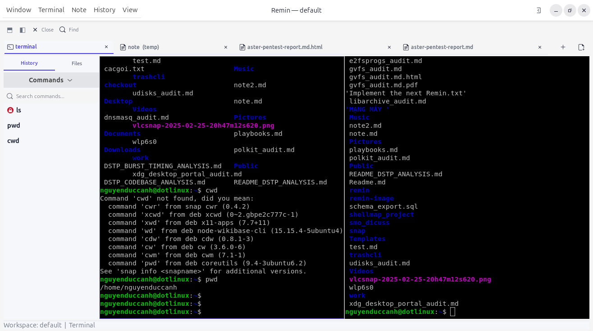
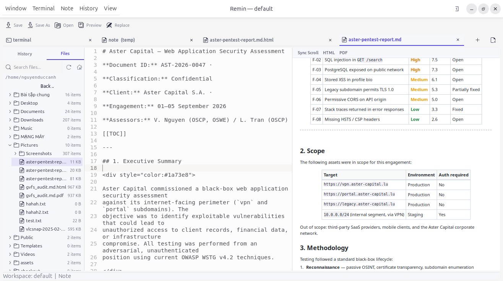
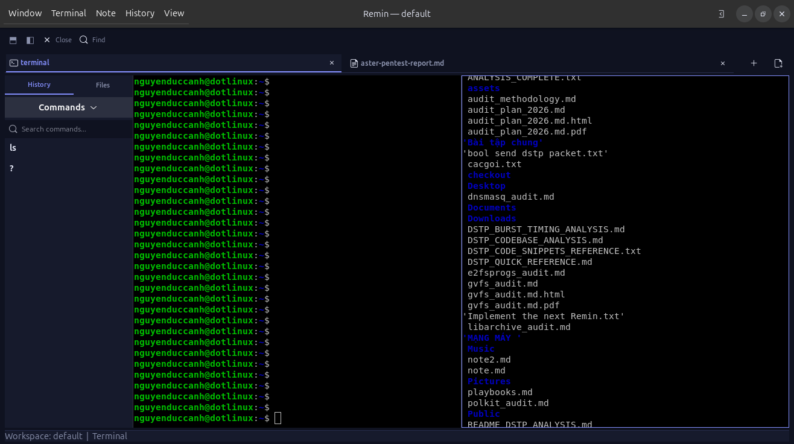
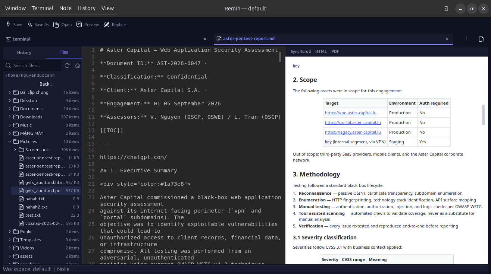

<p align="center">
  
</p>

<h1 align="center">Remin</h1>

<p align="center">
  <strong>Remember your work.</strong>
</p>

<p align="center">
  <a href="#features"></a>
  <a href="#build"></a>
  <a href="#stack"></a>
  <a href="#license"></a>
</p>

<p align="center">
  A <strong>Linux-native CLI workspace application</strong> that saves, restores,
  and carries your terminal workspace — tabs, panes, command history, notes,
  and scrollback — across time and machines.
</p>

<p align="center">
  <i>Think "git stash", but for your terminal workspace.</i>
</p>

---

```
Workspace
 └── Windows
      └── Tabs
           └── Panes
                └── Shell sessions
```

## Screenshots

Light theme:

<p align="center">
  
  <br/>
  <em>Remin — terminal + notes workspace (light)</em>
</p>

<p align="center">
  
  <br/>
  <em>Remin — panels & workflow (light)</em>
</p>

Dark theme:

<p align="center">
  
  <br/>
  <em>Remin — terminal + notes workspace (dark)</em>
</p>

<p align="center">
  
  <br/>
  <em>Remin — panels & workflow (dark)</em>
</p>

## Status — v1.0.0rc

V1 is a **single-window** on-screen workspace. The core engine already models
multiple windows (`Workspace → Window → Tab → Pane`) and persists each one
across restarts, but the GUI attaches to the *most recent* window and shows one
at a time. Multiple on-screen windows are a V2 feature (design-only today).

### Runtime dependency policy

Remin relies on a modified VTE 0.76 runtime that provides the
snapshot/restore API required for persistent terminal state.

Official binary distributions therefore never rely on an arbitrary
system VTE implementation.

- Debian packages ship the Remin-patched VTE runtime privately.
- AppImage bundles the complete GTK/VTE runtime.
- macOS application bundles include the patched VTE dylib.
- System Wayland/X11 integration remains provided by the host system.
- Development dependencies may be installed through the platform's
  package manager; they are not runtime requirements for official
  self-contained releases.

## Install

- **AppImage** (recommended, portable) — give
  `Remin-1.0.0-linux-x86_64.AppImage` +x and run it; no system packages needed.
- **Debian/Ubuntu** — `sudo apt install ./remin_1.0.0_amd64.deb`.
- **From source** — see [docs/installation.md](docs/installation.md) and
  [building](docs/development/building.md).

Then:

```bash
remin gui
```

## Features

- **Workspace Engine** — `Workspace → Window → Tab → Pane`, GUI/CLI/IPC agnostic
- **Single-window GUI (V1)** — binds to the most recent persisted window; core
  windows survive restarts, multi-window UI lands in V2
- **Crash-safe recovery** — atomic SQLite checkpoints; restart restores terminals
  (cwd, size, full scrollback via a VTE snapshot), notes, dir tree, and geometry
- **Edge-triggered autosave** — flushes once per typing burst, never a blind timer
- **SQLite storage** — one canonical `remin.db`, transactional, crash-safe
- **Command history** — canonical per-pane `command_history` (cap 1000) with an
  aggregate sidebar; searchable, click-to-insert
- **Notes** — markdown editor with live preview, and HTML/PDF export
  (TOC, clickable links, monospace code / tables)
- **Directory tree** — VS Code-style panel with live filter, context menu,
  and open-in-editor
- **Linux PTY** — `forkpty()` through a `PTYProvider` abstraction
- **Single binary** — `remin`, one build, three frontends (GUI / CLI / IPC)
- **Text-first UI** — no icon soup; navigate by words, spacing, and keyboard

## Technical Highlights

### Persistent VTE Terminal State

Remin solves a problem that terminal applications normally leave to
the terminal emulator itself: restoring a terminal exactly as it was
before the application exited.

Remin does not replay terminal output, proxy the PTY, or implement a
second terminal emulator.

Instead, Remin adds a small snapshot/restore API to VTE 0.76.0 and
serializes the canonical VTE terminal state directly.

#### What this enables

A restored terminal can retain state such as:

- screen contents
- scrollback
- cursor position and state
- alternate/normal screen
- terminal modes
- colors and attributes
- palette
- scroll region
- tab stops
- hyperlinks
- charset state
- other terminal state required for behavioral continuity

The goal is not to reproduce the visible text. The goal is to restore
the terminal state itself.

Conceptually:

```
snapshot(A)
    ↓
application restart
    ↓
restore(snapshot(A))
    ↓
continue using the same VTE terminal
```

The intended semantic property is:

```
RESTORE(snapshot(A)) + X
    ≈
state(A) + X
```

for supported future terminal actions `X`.

#### VTE patch series

The VTE extension is maintained as a small, versioned patch series
against VTE 0.76.0:

```
patches/
└── vte-0.76.0/
    ├── 0001-vte-0.76.0-public-snapshot-api.patch
    ├── 0002-vte-0.76.0-internal-snapshot-declarations.patch
    ├── 0003-vte-0.76.0-snapshot-serialization-and-restore.patch
    ├── 0004-vte-0.76.0-public-snapshot-wrappers.patch
    ├── SERIES.md
    └── SHA256SUMS
```

The patch series is intentionally kept separate from the Remin
application source tree so that the VTE integration can be inspected,
reproduced, and potentially reused independently.

Multiple versions can live side by side for maintainability:

```
patches/
├── vte-0.76.0/
├── vte-0.78.x/
└── …
```

See [VTE Patch Documentation](docs/patches/vte/README.md).

#### Who may find this useful?

This patch series may be useful for terminal applications that need
to preserve terminal emulator state across process restarts without:

- replaying terminal output
- recording and re-feeding PTY traffic
- maintaining a custom terminal emulator
- depending on terminal-specific text reconstruction

Remin is the reference consumer of this interface, but the patch series
is kept separate so the approach can be studied and reused independently.

### Markdown Document Engine

Notes share one **document engine** built on md4c: parsing is separated from
layout, so the live preview and the HTML/PDF export render the same source of
truth. Inline code spans (even with spaces), GFM-style tables, TOC and
`<!-- pagebreak -->` markers, and image resolution (`~/remin-image/`) all
behave identically in editor, preview, and export.

See [Markdown architecture](docs/design/markdown-document-engine.md).

## Stack

| Component  | Choice                                |
|------------|---------------------------------------|
| Language   | C++20                                 |
| GUI        | GTK4 + gtkmm4 + VTE GTK4 + libadwaita |
| Storage    | SQLite (canonical) + nlohmann/json    |
| PTY        | forkpty() via PTYProvider abstraction |
| IPC        | Unix domain socket (CLI ↔ GUI)        |

Linux-first, MIT.

## Build

Requirements: CMake ≥ 3.24, a C++20 compiler, and the GTK/VTE dev packages
(`gtkmm-4.0`, `vte-2.91-gtk4`, `libadwaita-1`, `librsvg2-dev`).

Scrollback restore relies on a small snapshot API layered on pristine VTE 0.76
(reproducible via `scripts/build-vte.sh` — see
[the VTE extension](docs/patches/vte/README.md)). Build Remin against that
patched VTE:

```bash
scripts/build-vte.sh                 # builds vte-0.76.0-patched/
PKG_CONFIG_PATH=vte-0.76.0-patched/build/meson-uninstalled \
LD_LIBRARY_PATH=vte-0.76.0-patched/build/src \
cmake -S . -B build -G Ninja -DCMAKE_BUILD_TYPE=Release
cmake --build build
ctest --test-dir build --output-on-failure
```

The single binary is `build/src/app/remin` (run as `./remin gui`).

## Run

```bash
remin gui   # everything else happens inside the app
```

## Layout

```
src/
├── app/       — single `remin` binary entry
├── core/      — Workspace Engine (GUI/CLI/IPC agnostic)
├── storage/   — SQLite backend
├── terminal/  — PTY + shell + event loop
├── ipc/       — Unix domain socket
├── gui/       — GTK/VTE frontend
└── cli/       — CLI frontend + request dispatcher
```

## Documentation

- [docs/README.md](docs/README.md) — documentation index
- [`docs/architecture/`](docs/architecture/) — how the code is built
- [`docs/design/`](docs/design/) — design documents
- [`docs/patches/vte/`](docs/patches/vte/) — the VTE snapshot extension
- [`docs/protocols/`](docs/protocols/) — wire/protocol specs
- [`docs/decisions/`](docs/decisions/) — ADRs
- [`docs/usage/`](docs/usage/) — user guides

## Sponsoring

Remin is open source and developed independently. If Remin is useful to you
and you'd like to support its continued development — maintenance, bug fixes,
documentation, cross-platform packaging — you can sponsor the project through
GitHub Sponsors.

[](https://github.com/sponsors/dotlinux26)

## License

MIT